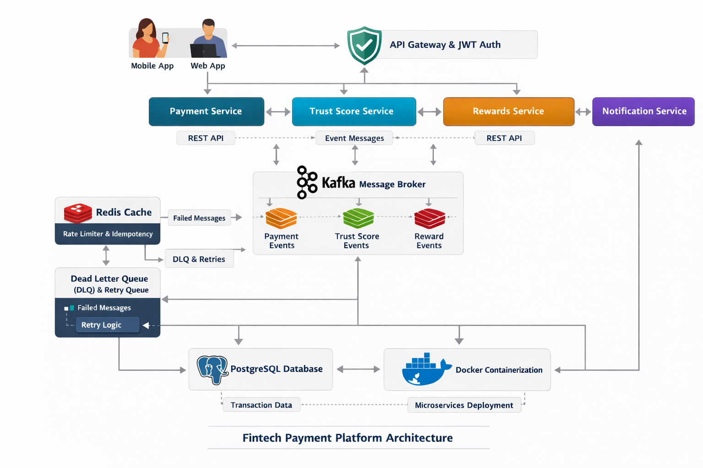
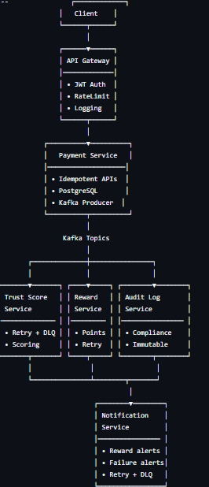

# 💳 Payment Processing & Trust Scoring Platform  & Notiifcation 
###  Fintech Backend System



---

## 🚀 Project Overview

This project is a **production-grade fintech backend system** built using **Java, Spring Boot, Kafka, Redis, and PostgreSQL**.

It simulates how real payment platforms like **CRED, Stripe, Razorpay** work internally by using:

- Microservices architecture  
- Event-driven communication  
- Idempotent APIs  
- Retry & Dead Letter Queue (DLQ)  
- Redis-based rate limiting  
- Audit logging for compliance  

The system is **scalable, fault-tolerant, and interview-ready**.

---

## 🧱 High-Level Architecture



## 🔥 Core Features

### 🔐 Authentication & Security
- JWT authentication (Access + Refresh tokens)
- Redis-based token blacklist
- Role-based authorization
- Security enforced at API Gateway

---

### 💰 Payment Processing
- **Idempotent payment APIs**
- Duplicate transaction prevention
- Persistent payment lifecycle
- Secure user identity propagation

---

### ⚡ Event-Driven Architecture
- Apache Kafka for async communication
- Loose coupling between services
- Scalable and fault-tolerant design

---

### ♻️ Retry & Dead Letter Queue (DLQ)
- Automatic retries with exponential backoff
- Dead Letter Topics for failed events
- Manual recovery possible
- Used in Trust, Reward & Notification services

---

### 🎯 Trust Score System
- Real-time trust score updates
- Payment-based scoring algorithm
- Retry-safe Kafka consumers


---

### 🎁 Reward System
- Reward points calculation
- Idempotent reward creation
- Kafka-based reward events


---

### 📢 Notification System
- Reward notifications
- Payment failure alerts
- Retry + DLQ enabled


---

### 🧾 Audit Log Service (Compliance-Ready)
- Listens to **all critical Kafka events**
- Stores immutable audit records
- Useful for:
  - Fraud detection
  - Compliance (PCI-DSS / RBI)
  - Production debugging

---

### 🚦 Rate Limiting (Redis)
- Implemented at API Gateway
- Prevents:
  - Bot attacks
  - Brute-force payments
  - DDoS attempts
- Configurable per user & endpoint

---

## 🛠 Tech Stack

| Layer | Technology |
|---|---|
Backend | Java 17, Spring Boot |
API Gateway | Spring Cloud Gateway |
Messaging | Apache Kafka |
Database | PostgreSQL |
Cache | Redis |
Authentication | JWT |
Containerization | Docker, Docker Compose |
Architecture | Microservices |
Patterns | Event-Driven, Idempotency, Retry, DLQ |

---

## 📦 Microservices Overview

| Service | Responsibility |
|---|---|
API Gateway | Routing, Auth, Rate Limiting |
Auth Service | User auth, JWT, refresh tokens |
Payment Service | Payment creation & events |
Trust Score Service | Trust score calculation |
Reward Service | Reward points processing |
Notification Service | User notifications |
Audit Log Service | Compliance & audit logging |

---

## 🔁 End-to-End Payment Flow

1. User logs in → receives JWT  
2. Client calls `/payments` with:
   - `Authorization: Bearer <JWT>`
   - `Idempotency-Key: <UUID>`
3. API Gateway:
   - Validates JWT
   - Applies rate limiting
4. Payment Service:
   - Stores payment
   - Publishes `payment.created`
5. Downstream services react:
   - Trust score updated
   - Rewards calculated
   - Notifications sent
   - Audit logs stored

---


---

## 🐳 Running the Project

### Prerequisites
- Docker & Docker Compose
- Java 17 (optional for local development)

### Start All Services
```bash
docker compose up --build

